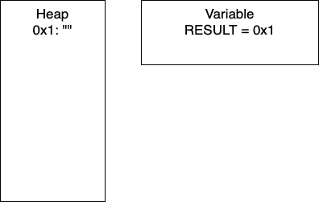
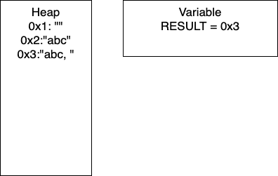
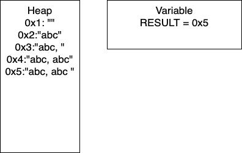
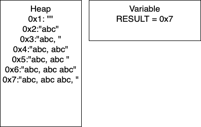

Consider the following block of pseudocode: 

```tex
1. function APPENDER(NUMBER, BASE)
2.     RESULT = ""
3.     loop I from 1 to NUMBER
4.         RESULT = RESULT + BASE
5.         if I MOD 2 = 0
6.             RESULT = RESULT + " "
7.         else
8.             RESULT = RESULT + ", " 
9.     end loop
10.    return RESULT
11. end function
```
Lets step through the function call with `APPENDER(4,'abc')` and analyze the memory that the code takes. 

{}

Recall that strings are reference variables. As such, string variables hold pointers to values and the value is stored in memory. For the following example, the `HEAP` refers to what is currently stored in memory and `VARIABLE` shows the current value of the variable `RESULT`.

{}


- Initialization: In line two, we initialize `RESULT` as an empty string. In the heap, we have the empty string at memory location `0x1`. Thus, `RESULT` is holding the pointer `0x1`.


- I = 1: Now we have entered the loop and on line 4, we add more characters to our string. At this point, we would have entry `0x2` in our heap and our variable `RESULT` would have the pointer `0x2`. Continuing through the code, line 5 determines if `I` is divisible by 2. In this iteration `I = 1`, so we take the else branch. We again add characters to our string, resulting in a new entry in `0x3` and our variable `RESULT` containing the pointer `0x3`. In total, we have written 8 characters. We then increment `I` and move to the next iteration. 


- I = 2: We continue the loop and on line 4, we add more characters to our string. At this point, we would have entry `0x4` in our heap and our variable `RESULT` would have the pointer `0x4`. Continuing through the code, line 5 determines if `I` is divisible by 2. In this iteration `I = 2`, so we take the if branch. We again add characters to our string, resulting in a new entry in `0x5` and our variable `RESULT` containing the pointer `0x5`. In this iteration, we have written 17 characters. We then increment `I` and move to the next iteration of the loop.


- I = 3: We continue the loop and on line 4, we add more characters to our string. At this point, we would have entry `0x6` in our heap and our variable `RESULT` would have the pointer `0x6`. Continuing through the code, line 5 determines if `I` is divisible by 2. In this iteration `I = 3`, so we take the if branch. We again add characters to our string, resulting in a new entry in `0x7` and our variable `RESULT` containing the pointer `0x7`. In this iteration, we have written 26 characters. We then increment `I` and thus `I = 4` breaking out of the loop. 


We can do some further analysis of the memory that is required for this particular block. 
| Iteration | Memory Entries| Total Character Copies |
| ----------| --------------| -----------------|
| 1 | 3 | 8 |
| 2 | 5 | 8 + 17 = 25|
| 3 | 7 | 25 + 26 = 51 |
| 4 | 9 | 51 + 35 = 86|
| . | . | . |
| n | 2n + 1 | (9n<sup>2</sup> + 7n)/2|

You need not worry about creating the equations! Based on this generalization, if the user wanted to do 100K iterations, say for gene sequencing, there would be (2x100,000 - 1) = 200,001 memory entries and (9x100,000<sup>2</sup> + 7x100,000)/2 = 45 billion character copies. This behavior is not exclusive to strings; this will occur for any immutable type. 

While this example is contrived, it is not too far off the mark. Another caveat to this analysis is that, depending on our programming language, there will be a periodic 'memory collection'; there wont be 200K memory addresses occupied at one time. Writing to memory in this way can be costly in terms of time, which in industry is money. 


