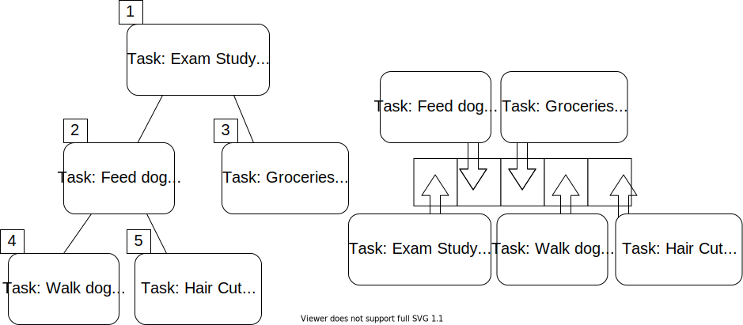

{}

A natural implementation of heaps is priority queues. 

A **priority queue** is a data structure which contains elements and each element has an associated key value. The key for an element corresponds to its importance. In real world applications, these can be used for prioritizing work tickets, emails, and much more. 


We can use a heap to organize this data for us. 




As with heaps, we can have min-priority queues and max-priority queues. For the applications listed above, a max-priority queue is the most intuitive choice. For this course however, we will focus more on min-priority queues which will give us better functionality for greedy algorithms, like Prim's algorithm. 


Prim's Revisited
---

For the minimum spanning tree algorithms, using a min-priority queue helps the performance of the algorithms. Recall Prim's algorithm, shown below. Each time we visited a new node, we would add the outgoing edges to the list of available edges, remove the smallest edge, and sort the list. 

``` tex
function PRIM(GRAPH, SRC)
    MST = GRAPH without the edges attribute(s)
    VISITED = empty set
    add SRC to VISITED
    AVAILEDGES = list of edges where SRC is the source
    sort AVAILEDGES
    while VISITED is not all of the nodes
        SMLEDGE = smallest edge in AVAILEDGES
        SRC = source of SMLEDGE
        TAR = target of SMLEDGE
        if TAR not in VISITED
            add SMLEDGE to MST as undirected edge
            add TAR to VISITED
            add the edges where TAR is the source to AVAILEDGES
        remove SMLEDGE from AVAILEDGES
        sort AVAILEDGES
    return MST
```

If we implement Prim's algorithm with min-priority queue, we don't have to worry about sorting the edges every time we add or remove one. 

``` tex
function PRIM(GRAPH, SRC)
    MST = GRAPH without the edges attribute(s)
    VISITED = empty set
    add SRC to VISITED
    AVAILEDGES = min-PQ of edges where SRC is the source
    while VISITED is not all of the nodes
        SMLEDGE = smallest edge in AVAILEDGES
        SRC = source of SMLEDGE
        TAR = target of SMLEDGE
        if TAR not in VISITED
            add SMLEDGE to MST as undirected edge
            add TAR to VISITED
            add the edges where TAR is the source to AVAILEDGES
        remove SMLEDGE from AVAILEDGES
    return MST
```

