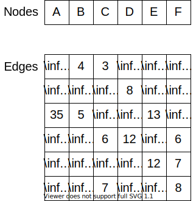

{}

There are two types of graphs that we've covered in this class: list graphs and matrix graphs. Graphs are slightly different than other data structures, because we may want to find or access both nodes and edges in the graph. So, we'll need to analyze the performance of graphs with respect to both nodes and edges.

### Matrix Graph

Recall that a matrix graph uses an array to store the nodes, and a two-dimensional array to store the edges. 

* **Insert Node**: Inserting a node is a linear time operation. To insert node, we looped through the nodes attribute and put the node in the first open index. Thus, it is linear with respect to the number of nodes.

* **Access Node**: Likewise, given the index of a node, we can get it's value in constant time by accessing the array.

* **Find Node**: To find the index of a node when we are given its value, we must iterate through the array of nodes, which will be a linear time operation based on the number of nodes in the graph.

* **Delete Node**: Finally, to remove a node from a graph we can simply set its value in the array of nodes to `null`. However, we may also need to go through the list of edges and make sure there are no edges to or from that node, so typically this operation runs on the order of the number of nodes in the graph since we must check each one. 

For the operations relating to edges below, we'll assume that we already know the indices of the two nodes we are connecting. If we don't know those, we'll have to use the find node process above first. 

* **Insert Edge**: To insert an edge into the graph we simply update the element in the two-dimensional array, which can be done in constant time.

* **Access Edge**: Likewise, to access an edge between two nodes, we simply access the element in the two-dimensional array, which is a constant time operation. 

* **Find Neighbors**: Instead of finding a particular edge, we'll say that we want to find all of the neighboring nodes that can be accessed from a given node. In this case, we'll need to iterate through one row of the two-dimensional array, so the whole process runs on the order of linear time based on the number of nodes in the graph.

* **Delete Edge**: To remove an edge, we simply find it in the two-dimensional array and set its value to infinity, which can be done in constant time.

So, for most matrix graph operations, we can do nearly everything in either constant time or, at worst, linear time based on the number of nodes in the graph. 

* **Memory**: Here is where things get interesting. Generally, we say that a matrix graph consumes $n^2$ memory, where $n$ is the number of nodes in the graph. This is because the two-dimensional array of edges is the vast majority of the memory consumption in a matrix graph. So, if the number of nodes is doubled, the memory usage will quadruple. 

### List Graph

Recall that a list graph uses an array to store the nodes, and then each node stores a list of edges that start from that node.  

* **Insert Node**: Inserting a node is a linear time operation. To insert node, we looped through the nodes attribute and put the node in the first open index. Thus, it is linear with respect to the number of nodes.

* **Access Node**: Likewise, given the index of a node, we can get it's value in constant time by accessing the array.

* **Find Node**: To find the index of a node when we are given its value, we must iterate through the array of nodes, which will be a linear time operation based on the number of nodes in the graph.

* **Delete Node**: Finally, to remove a node from a graph we can simply set its value in the array of nodes to `null`. However, we may also need to go through each other node and check to make sure it isn't in the list of edges. So typically this operation runs on the order of the number of nodes in the graph since we must check each one. 

So far, a list graph seems to be pretty similar to a matrix graph in terms of performance. The real difference comes with how we handle edges, as well see next. 

For the operations relating to edges below, we'll assume that we already know the indices of the two nodes we are connecting. If we don't know those, we'll have to use the find node process above first. 

* **Insert Edge**: To insert an edge into the graph, we must get the source node from the nodes array and then add an element to the list of edges. Assuming that the edges are stored in a linked list, this is a linear time operation in terms of the number of nodes since we may have to iterate through the list of edges to make sure this edge doesn't already exist and need updated. In the worst case, there may be $n$ edges here, so it is a linear operation. 

* **Access Edge**: To access an edge between two nodes, we first find the source node in the list of nodes, which is a constant time operation. Then, we'll have to iterate through the list of edges, which is at worst linear time based on the size of the graph, since there could be $n$ outgoing edges from this node. So, overall the operation runs on the order of linear time based on the number of nodes in the graph. 

* **Find Neighbors**: Instead of finding a particular edge, we'll say that we want to find all of the neighboring nodes that can be accessed from a given node. In this case, we can just find the source node in the array of nodes, which is a constant time operation. Then, we can simply return the list of edges, which is also constant time. So, this operation is very efficient!

* **Delete Edge**: To remove an edge, we find the source node and iterate through the list of edges until we find the one to remove. So, this runs in linear time based on the number of nodes in the graph.

So, for most list graph operations, we can also do nearly everything in either constant time or, at worst, linear time based on the number of nodes in the graph. The only real difference comes in how we handle edges, where some operations are a bit slower, but getting a list of all the neighbors of a node is actually a little quicker!

* **Memory**: For a list graph, we typically say the memory usage is on the order of $n + e$, where $n$ is the number of nodes in the graph and $e$ is the number of edges in the graph. 

{}

# Dense vs. Sparse Graphs

Let's analyze the memory usage of matrix and list graphs when dealing with dense and sparse graphs. This is the real key difference between the two data structures.

## Dense Graph

A dense graph is a graph that has a large number of edges compared to the maximum number of edges possible. More specifically, the maximum number of edges a graph can have is $n^2$, so we would say a dense graph has a value for $e$ that is close to $n^2$. Because of this, the memory usage of a matrix graph ($n^2$) is actually a bit more efficient than a list graph ($n + n^2$) because it doesn't have the extra overhead of maintaining a list structure for each node.

## Sparse Graph

A sparse graph is a graph that has a small number of edges compared to the maximum number of edges possible. So, here we would say that the value of $e$ is much smaller than $n^2$, though it may still be larger than $n$ (otherwise each node would only have one edge coming from it, and this would be a linked list). In that case, we see that $n + e$ is much smaller than $n^2$, and a list graph is much more efficient. If you think about it, in a matrix graph a large number of the entries in the two-dimensional array would be set to infinity and unused, but they still take up memory. Those unused edges wouldn't exist in a list graph, making it much more memory efficient.

{}
