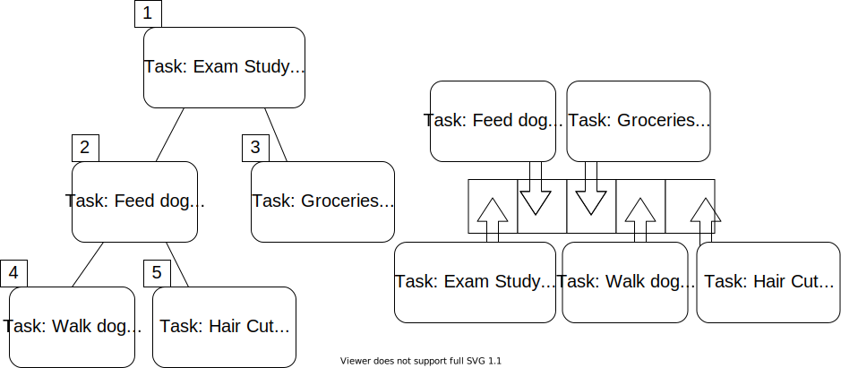

{}

Let's look at the performance of priority queues next. These structures are based on a heap, which has some unique characteristics related to the _heap properties_ that it must maintain. 

Recall that a heap is an array which we can view as an unsorted binary tree. This tree must have the following properties:
1. Each node has at most two children.
1. If there are nodes in level `i` of the tree, then level `i-1` is full. 
1. The nodes of the last level are as far left as possible.

* **Insert** To insert a new element in a priority queue, we place it at the end and then push it upwards until it is in the correct place. Because the heap property creates a perfectly balanced tree, at most it will have to perform $log_2(n)$ or $h$ operations. So, we say that insert runs on the order of $log_2(n)$ where $n$ is the number of elements in the heap.

* **Access Minimum** The most common operation for accessing elements in the priority queue is to access the minimum element. Since it should always be the first element in the array due to the heap properties, this is clearly a constant time operation.

* **Find Element** To find an item in a priority queue, we must simply iterate through the array that stores the heap, which is a linear time operation based on the number of elements in the heap.

* **Remove Minimum** To remove the smallest element, we swap it with the last element and then remove it, then push the top element down into place. Similar to the push up operation, at most it will perform $log_2(n)$ or $h$ operations. So, we say that remove minimum runs on the order of $log_2(n)$ where $n$ is the number of elements in the heap.

* **Heapify** This is the most interesting operation of a heap. When we use heapify, we add a large number of elements to the heap and then sort it exactly once by working from the bottom to the top and pushing down each element into place. On the surface, it appears that this should run in the order $n * log_2(n)$ time, since each push down operation takes $log_2(n)$ time, and we have to do that on the order of $n$ times to get each element in place. However, using a bit of mathematical analysis, it is possible to prove that this operation actually runs in linear time $n$ based on the number of elements. The work to actually prove this is a bit beyond the scope of this course, but [this StackOverflow discussion](https://stackoverflow.com/questions/9755721/how-can-building-a-heap-be-on-time-complexity) is a great explanation of how it works.

* **Memory**: In terms of memory usage, a priority queue uses memory that is on the order of the number of elements in the priority queue. 

{}

# Heapify and Heap Sort

Why is it important that heapify runs in linear time? That is because we can use heapify and remove minimum to sort data, which is a sorting algorithm known as heap sort.

We already saw that heapify runs in linear time based on the number of nodes, and each remove minimum operation runs in $log_2(n)$ time. To remove all the elements of the heap, we would do that $n$ times, so the overall time would be $n * log_2(n)$ time. If you recall, that is the same performance as merge sort and quicksort!

{}
