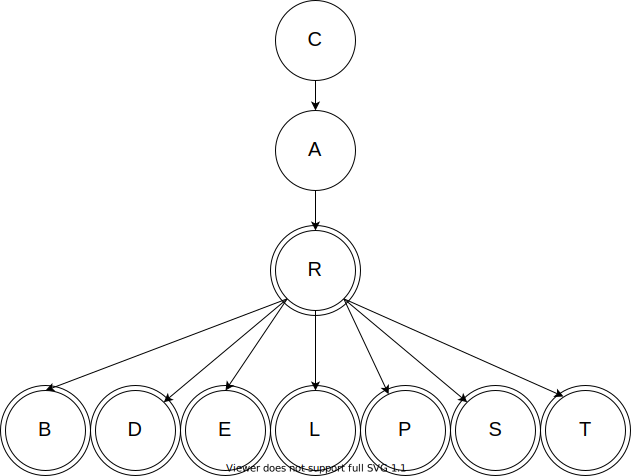

In general, trees are good for hierarchical data. While trees can be used for linear data, it is inefficient to implement them in that way (from a certain point of view, a linked list is simply a tree where each node can only have one child). When data points have many predecessors, trees cannot be used. Thus, trees are not suitable for most relational data. 

Trees 
---

To recap, we defined a tree as having the following structure:
- There must be a single root,
- Each child node has a single parent node,
- It must be fully connected (no disjoint parts), and
- There can be no cycles (no loops).

In this course, we used trees to represent family lineage and biologic classifications. Once we have the data in a tree, we can perform both preorder and postorder traversals to see all of the data, and we can use the structure of the tree to determine if two elements are related as ancestor and descendant or not.

We added constraints to trees to give us special types of trees, discussed below. 

Tries
---

A trie is a type of tree with some special characteristics, which are: 
- Each node contains a single character, with the root node containing an empty character by convention
- By starting at the root and traversing parent to children relationships, we can build user-defined words using those characters, and
- Each node has a boolean property to indicate if it is the end of a word.

Tries are best suited for data sets in which elements have similar prefixes. In this course we focused on tries to represent words in a language, which is the most common use of tries. We used tries for an auto-complete style application. 

Tries are a very efficient way of storing dense hierarchical data, since each node in the trie only stores a single portion of the overall data. They also allow quickly looking up if a particular element or path exists - usually much quicker than looking through a linear list of words. 

Binary Trees
---

A binary tree is a type of tree with some special characteristics, which are:
- Each node has at most 2 children (nodes can have 0, 1, or 2 children), and
- unlike general trees, the children in a binary tree are not an unordered set. The children must be ordered such that:
    - all of the descendants in the left tree are less than the parent's value, and
    - all of the descendants in the right tree are greater than the parent's value

Binary trees are the ideal structure to use when we have a data set with a well defined ordering. Once we have the data stored in a binary tree, we can also do an inorder traversal, which will access the elements in the tree in sorted order. We will discuss in the next chapter why we might want to choose a binary tree based on its performance. 

