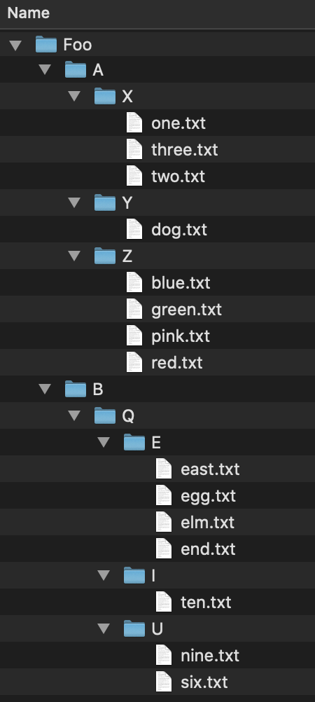

{}

For the next data structure in the course, we will cover trees, which are used to show hierarchical data. Trees can have many shapes and sizes and there is a wide variety of data that can be organized using them. Real world data that is appropriate for trees can include: family trees, management structures, file systems, biological classifications, anatomical structures and much more. 

---

We can look at an example of a tree and the relationships they can show. Consider this file tree; it has folders and files in folders.

If we wanted to access the file `elm.txt`, we would have to follow this file path: `Foo/B/Q/E/elm.txt`. We can similarly store the file structure as a tree like we below. As before, if we wanted to get to the file `elm.txt` we would navigate the tree in the order: `Foo -> B -> Q -> E -> elm.txt`. As mentioned before, trees can be used on very diverse data sets; they are not limited to file trees! 

## What are trees?
In the last module we talked about strings which are a linear data structure. To be explicit, this means that the elements in a string form a line of characters. A tree, by contrast, is a **hierarchal structure** which is utilized best in multidimensional data. Going back to our file tree example, folders are not limited to just one file, there can be multiple files contained in a single folder- thus making it multidimensional. 

Consider the string "abc123"; this is a linear piece of data where there is exactly one character after another. We can use trees to show linear data as well. 

While trees *can* be used for linear data, it would be excessive and inefficient to implement them for single strings. In an upcoming module, we will see how we can use trees to represent any number of strings! For example, this tree below contains 7 words: 'a', 'an', 'and', 'ant', 'any', 'all', and 'alp'.

In the next sections, we will discuss the properties of a tree data structure and how we would design one ourselves. Once we have a good understanding of trees and the properties of trees, we will implement our own. 
