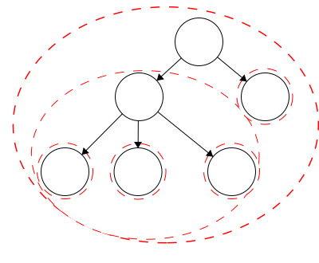

{}

{}

A recursive program is broken into two parts:

* A **base case**---a simple version of the problem that can be solved directly, and
* A **recursive case**---a general solution to the problem that uses smaller versions of the problem to compute the solution to the larger problem.

{}

In principle, the recursive case breaks the problem down into smaller portions until we reach the base case. Recursion presents itself in many ways when dealing with trees. 

Trees are defined recursively with the base case being a single node. Then we recursively build the tree up. With this basis for our trees, we can define many properties using recursion rather effectively. 
