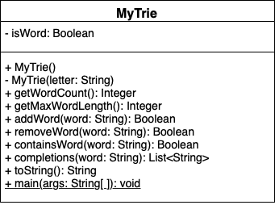

To implement our own trie, we will build off of MyTree that we built recursively. We will add an attribute to our tree to reinforce which nodes are words and which ones are not. 



### Attributes 
We have the existing attributes of MyTree: parent, children, and item. For MyTrie, we introduce the boolean attribute `is_word` to delineate if our trie is a word. 

### Adding a Word 

{}

To add a word to our trie, we traverse through the trie letter by letter. We can define this recursively. 
- Base Case: length of the word is zero and it was already a word in our trie, return false (because we did not add the word) OR length of the word is zero and it is not already a word in our trie, set the boolean for the node at the end of the word to true and return true
- Recursive case: split the string into the first character and the rest. Get the node of the first letter of the string; if it does not exist create it, then run the add word function on the remainder of the string.

```tex
function ADDWORD(WORD)
    if WORD length is 0
        if already a word
            return false
        else
            set is_word to true
            return true
    else
        FIRST = first character of WORD
        REMAIN = remainder of WORD
        CHILD = FINDCHILD(FIRST)
        if CHILD is NONE
            NODE = new MyTrie with item equal FIRST
            insert NODE into our existing trie 
            CHILD = NODE
        return CHILD.ADDWORD(REMAIN)
end function
```

### Removing a Word

{}

Similar to adding a word, we traverse our trie letter by letter. Once we get to the end of the word set `is_word` to false. If the word ends at a leaf, we will remove the leaf (then if the second to last character is a leaf, we remove the leaf and so on). If the word does not end in a leaf, meaning another word uses that node, we will not remove the node.  
- Base Case: length of the word is zero and it was not a word in our trie, return false (because we did not remove the word) OR length of the word is zero and it is  already a word in our trie, set the boolean for the node at the end of the word to false and return true
- Recursive case: split the string into the first character and the rest. Get the node of the first letter of the string, if that node does not exist, return false (because we did not remove the word). If the node does exist run remove word on the child for the remainder of the word. After that, if the node's `is_word` is false and it is a leaf, remove the node. 

```tex
function REMOVEWORD(WORD)
    if WORD length is 0
        if already not a word
            return false
        else
            set is_word to false
            return true
    else
        FIRST = first character of WORD
        REMAIN = remainder of WORD
        CHILD = FINDCHILD(FIRST)
        if CHILD is NONE
            return false
        else
            RET = CHILD.REMOVEWORD(REMAIN)
            if CHILD is not a word AND CHILD is a leaf
                REMOVECHILD(CHILD)
            return RET
end function
```


### Check if trie contains word

{}

Again, we will traverse the trie letter by letter. Once we get to the last letter, we can return that nodes `is_word` attribute. There is a chance that somewhere in our word, the letter is not a child of the previous node. If that is the case, then we return false. 

```tex
function CONTAINSWORD(WORD)
    if WORD length is 0
        return `is_word`
    else
        FIRST = first character of WORD
        REMAIN = remainder of WORD
        CHILD = FINDCHILD(FIRST)
        if CHILD is NONE
            return false
        else
            return CHILD.CONTAINSWORD(REMAIN)
end function
```


