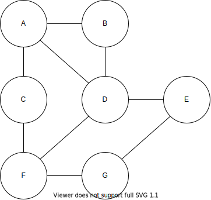
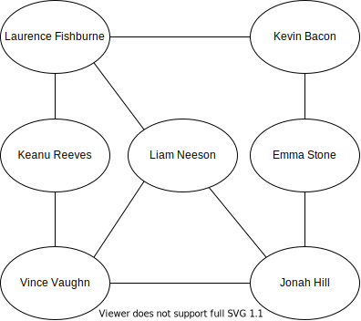

{}

The next data structure we will introduce is a graph. 

Graphs are multidimensional data structures that can represent many different types of data. We can use graphs to represent electronic circuits and wiring, transportation routes, and networks such as the Internet or social groups. 

A popular and fun use of graphs is to build connections between people such as Facebook friends or even connections between performers. One example is the parlor game [Six Degrees of Kevin Bacon](https://en.wikipedia.org/wiki/Six_Degrees_of_Kevin_Bacon). Players attempt to connect Kevin Bacon to other performers through movie roles in six people or less. 

For example, Laurence Fishburne and Kevin Bacon are directly connected via 'Mystic River'. Keanu Reeves and Kevin Bacon have never performed in the same film, but Keanu Reeves and Laurence Fishburne are connected via 'The Matrix'. Thus, Keanu and Kevin are connected via Laurence.

In this module we will discuss graphs in more detail and build our own implementation of graphs. 
