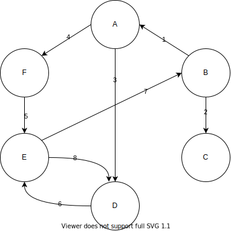
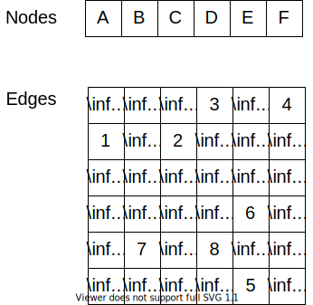
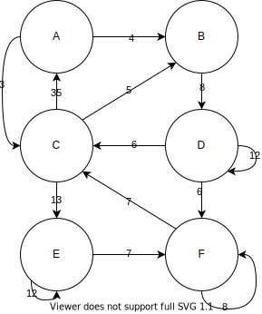
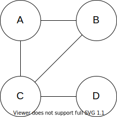

{}

The first way that we can represent graphs is as matrices. In a matrix representation of a graph, we will have an array with all the nodes and a matrix to depict the edges. The matrix that depicts the edges is called the `adjacency matrix`. 

To build the `adjacency matrix`, we go through the nodes and edges. If there is an edge with weight `w` going from `i` to `j`, then we put `w` in the `(i,j)` spot in our `adjacency matrix`. If there is no edge from `i` to `j` then we put infinity in the spot `(i,j)`. Let's look at some examples. 

{}

An edge that starts at `source` and ends at `target` will result in an entry at `(source,target)` in the adjacency matrix.

{}

{}

For an unweighted graph, we treat the weights as 1 for all edges in our adjacency matrix.

For an undirected edge between nodes `i` and `j`, we put an edge from `i` to `j` and an edge from `j` to `i`.

{}

Example 1
---

Suppose that we have the following graph: 

Across the top of the following, we have the array of nodes. This give us the index at which each node is located. For example, node A is in spot `1`, node B is in spot `2`, node C is in spot `3` and so on. 

Below that we have the adjacency matrix. For the directed edge with weight 2 that goes from node B to node C, we have the value 2 at (2,3) in the adjacency matrix as B has index 2 and C has index 3. For the directed edge with weight 4 that goes from node A to node F, we have the value 4 at (1,6) in the adjacency matrix as A has index 1 and F has index 6. 

Since there is no edge that connects from node A to node B, we have infinity in `(1,2)`.
 

Example 2
---
Now suppose we have this graph. We now have some loops present. 

For example, we have a loop on node E with weight 12 so we will put the value 12 in spot (5,5) as E has index 5.

Example 3
---
Now suppose we have this graph which is undirected and unweighted. 

Since this graph is unweighted, we will treat all edges as though they have weight equal to one. Since this graph is undirected, each edge will essentially show up twice. 

For example, for the edge that connects nodes A and B, we will have an entry in our adjacency matrix at `(1,2)` and `(2,1)`.

