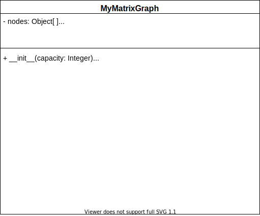

{}




Attributes
---

- `nodes`: This will keep track of the nodes which are in our graph as well as the node values. The nodes can have any type of value such as numbers, characters, and even other data structures.
- `edges`: This will keep track of the edges which are in our graph.
- `size`: This will keep track of the number of nodes that are active in our graph. 

Upon initialization, we will initialize `nodes` to be an empty array of size `capacity`, `edges` to be an empty two-dimensional array with dimensions `capacity` by `capacity` and `size` to be zero as we start with no actual nodes.


Getters 
---
- `get nodes`: returns a list of the nodes with their respective indexes
``` tex
function GETNODES()
    LIST = []
    for NODE in NODES
        if NODE has a VALUE
            append (VALUE, INDEX) to LIST
    return LIST
```

- `get edges`: returns a list of the edges in the format (source, target, weight)
``` tex
function GETEDGES()
    LIST = []
    for ROW in EDGES
        for COL in ROW
            VALUE = entry at (ROW,COL)
            if VALUE is not infinity
                    append (ROW,COL,VALUE) to LIST
    return LIST
```

- `get node`: returns the node with the given index. If the index is within the possible range, then we return the value of that node.

- `find node`: returns the index of the given node. We iterate through our nodes and if we find that value, then we return the index. Otherwise, return `-1`.

- `get edge`: returns the weight of the edge between the given indexes of the source node and target node. If one or both of the indexes are out of range, then we should return infinity. 

- `get capacity`: returns the maximum number of nodes we are allowed to have. Upon initialization, we will have a fixed number of possible nodes in our node array. We can simply return the size of this array. 

- `get size`: returns the size attribute. 

- `get number of edges`: returns the number of edges currently in the graph. We will iterate through our edges and return the number of entries that were not infinity. 

- `get neighbors`: returns the neighbors of the given node. We will access our row adjacency matrix that corresponds to the node and return the indexes and values of those entries which are not infinity. 
``` tex
function GETNEIGHBORS(IDX)
    if IDX in range of NODES length
        LIST = []
        ROW = the IDX-th row of EDGES
        for J in range  0 to ROW length
            VALUE = J-th entry of ROW
            if VALUE is not infinity
                    append (J,VALUE) to LIST
        return LIST
```
