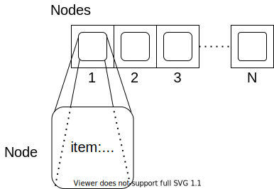
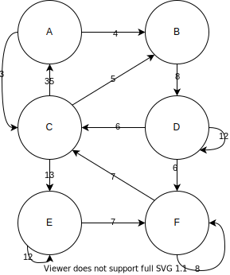
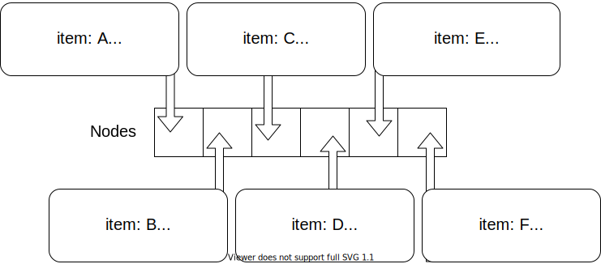

{}

In the matrix representation, we had an array of the node items. In the list representation, we will have an array of node objects. Each **node object** will keep track of the node item, the node index, and the outgoing edges. 

The `item` can be any object and the `index` will be a value within our capacity. The `edges` will be a list of pairs where the first entry is the index of the target node and the second entry is the weight of the edge. 

Since each node will track its neighbors, it is important that we are consistent in our indexing of nodes. If our nodes were to get out of order, then our edges would as well. 

Example 1
---
Consider the following graph which we saw in the matrix representation. 

The following list of nodes depicts the graph above. We can see that each node object has the item and index. 

If we look closer at the `edges` of the node with item `A` and index `1`, we see that the set of edges is equal to `[(4, 3.0), (6, 4.0)]`. This corresponds to the fact that there are two edges with the source as node `1`. The first ordered pair, `(4, 3.0)`, means that there is an edge with source node `1` (`A`) and target node `4` (`D`) that has weight `3`. We can confirm that in our graph we do have an edge from `A` to `D` with weight `3`.

Example 2
---
The following includes a couple of examples of loops within our graph. 

We have loops on nodes `D`, `E`, and `F` in our graph. Recall that a loop is an edge where the source and target are the same. For example, we have an edge with source `D` and target `D` that has weight `12`. We see this in our list representation in the node object with item `D` and index `4`, where we have the entry `(4,12.0)` in the edges. 

