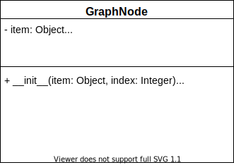

{}

In this representation, we will have an array of graph node objects. We will first cover the UML for the graph node objects and then discuss the graph functions and attributes. 




Attributes
---

- `item`: the value that the node contains.
- `index`: the index of the node.
- `edges`: ordered pairs `(e, w)` where this node is the source, `e` is the target node index, and `w` is the weight of the edge as a double. 

We will initialize a graph node with the given item and the given index. We initialize the `edges` attribute to be an empty list.


Getters
---

- `get item`: Returns the graph node's item.

- `get index`: Returns the graph node's index.

- `get edges`: Returns the graph node's edges.

- `get edge`: From the source node, we will call the get edge function with the index of the target node as input. This will return the edge weight.

``` tex
function GETEDGE(TARINDEX)
    for EDGE in nodes EDGES
        if the first element in EDGE is TARINDEX
            return the second element in EDGE
    return infinity 
```


Edge Functions
---

{}

Working with the edges in our graph becomes slightly more complicated in the list representation. Previously, we were able to go right to the entry in our adjacency matrix and update it. Since each node keeps track of its own edges in no particular order, we must loop through each entry of the edges attribute to find a potential edge. 

{}

- `add edge`: From the source node, we will call the add edge function with the target node as input as well as the weight. First, we will attempt to remove the edge. We need to do this as we do not want duplicate edges in our graph. Then we will add the ordered pair to the edges attribute. 

``` tex
function ADDEDGE(TARINDEX, WEIGHT)
    call REMOVEEDGE(TARINDEX) on this node
    append (TARINDEX, WEIGHT) to this nodes EDGES 
```

- `remove edge`: From the source node, we will call the remove edge function with the target node as input. This will return true if it was successful and false if not. 

``` tex
function REMOVEEDGE(TARINDEX)
    for EDGE in nodes EDGES
        if the first element in EDGE is TARINDEX
            remove EDGE from EDGES
            return true
    return false 
```

