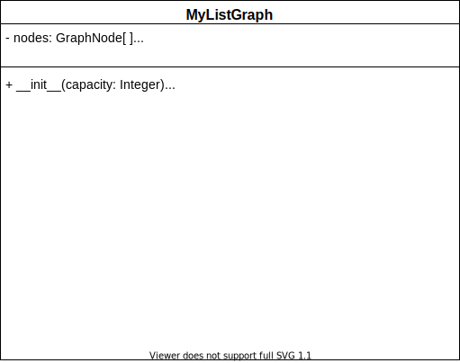

{}



Attributes
---

- `nodes`: This will keep track of the nodes which are in our graph as well as the node values. The nodes can have any type of value such as numbers, characters, and even other data structures.
- `size`: This will keep track of the number of nodes that are active in our graph. 

Upon initialization, we will initialize `nodes` to be an empty array with dimension `capacity` and `size` to be zero as we start with no actual nodes.


Getters 
---
- `get nodes`: returns a list of the nodes with their respective indexes. This will be the same logic from our matrix graph. 
``` tex
function GETNODES()
    LIST = []
    for NODE in NODES
        if NODE has a VALUE
            append (VALUE, INDEX) to LIST
    return LIST
```

- `get edges`: returns a list of the edges in the format (source, target, weight). 
``` tex
function GETEDGES()
    LIST = []
    for NODE in NODES
        if NODE is not empty
            for EDGE in NODE EDGES
                TAR = first entry of EDGE
                WEIGHT = second entry of EDGE
                append (NODE,TAR,WEIGHT) to LIST
    return LIST
```

- `get node`: returns the node with the given index. If the index is within the possible range, then we return the value of that node. This will be the same logic from our matrix graph. 

- `find node`: returns the index of the given node. We iterate through our nodes and if we find that value, then we return the index. Otherwise, return `-1`. This will be the same logic from our matrix graph. 

- `get edge`: returns the weight of the edge between the given indexes of the source node and target node. If one or both of the indexes are out of range, then we should return infinity. From the source node object, we will call the graph node get edge function on the target index. 
``` tex
function GETEDGE(SRC,TAR)
    if SRC and TAR are between 0 and capacity
        SRCNODE = the node at index SRC of the NODES attribute
        WEIGHT = call the graph node GETEDGE from SRCNODE on TAR
        return WEIGHT
    else
        return infinity
```

- `get capacity`: returns the maximum number of nodes we are allowed to have. Upon initialization, we will have a fixed number of possible nodes in our node array. We can simply return the size of this array. This will be the same logic from our matrix graph. 


- `get size`: returns the size attribute. This will be the same logic from our matrix graph. 

- `get number of edges`: returns the number of edges currently in the graph. 
``` tex
function NUMBEROFEDGES()
    COUNT = 0
    for NODE in NODES
        if NODE is not empty
            for EDGE in NODE EDGES
                increment COUNT by one
    return COUNT
```


- `get neighbors`: returns the neighbors of the given node. We will access our row adjacency matrix that corresponds to the node and return the indexes and values of those entries which are not infinity. 
``` tex
function GETNEIGHBORS(IDX)
    SRCNODE = the node at index IDX of the NODES attribute
    if SRCNODE is not empty
        return SRCNODE's edges 
    else
        return nothing
        
```
