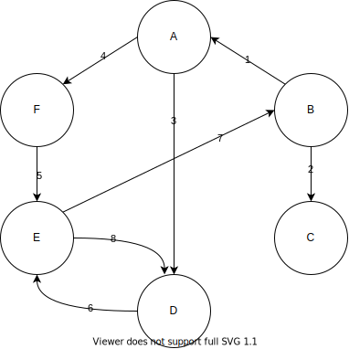
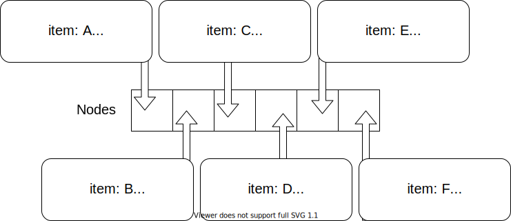
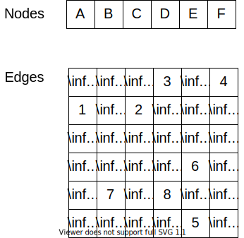

In this module, we introduced a new way to store the graph data structure. Thus, we now have two ways to work with graphs, in lists and in matrices: 

List Representation
---

Matrix Representation
---

While these methods show the same information, there are cases when one way may be more desirable than the other. 

We discussed how a sparse graph is better suited for a list representation and a dense graph is better suited for a matrix representation. We also touched on how working with the edges in a list representation can add complexity to our edge functions. If we are needing to access edge weights or update edges frequently, a matrix representation would be a good choice -- especially if we have a lot of nodes. 
