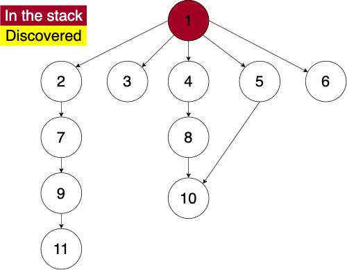

{}
[Video Slides](https://core.cs.ksu.edu/4-cc315/08-graph-traversal/02-graph-traversals-dfs-slides/#/)


First we will discuss Depth First Traversal. We can define the depth first traversal in two ways, iteratively or recursively. For this course, we will define it iteratively. 

In the iterative algorithm, we will initialize an empty stack and an empty set. The stack will determine which node we search next and the set will track which nodes we have already searched. 

{}

Recall that a stack is a 'Last In First Out' (LIFO) structure. Based on this, the depth first traversal will traverse a nodes descendants before its siblings.

{}


To do the traversal, we must pick a starting node; this can be an arbitrary node in our graph. If we were doing the traversal on a tree, we would typically select the root at a starting point. We start a while loop to go through the stack which we will be pushing and popping from. We get the top element of the stack, if the node has not been visited yet then we will add it to the set to note that we have now visited it. Then we get the neighbors of the node and put them onto the stack and continue the process until the stack is empty. 
 



``` tex
function DEPTHFIRST(GRAPH,SRC)
    STACK = empty array
    DISCOVERED = empty set
    append SRC to STACK
    while STACK is not empty
        CURR = top of the stack
        if CURR not in DISCOVERED
            add CURR to DISCOVERED
            NEIGHS = neighbors of CURR
            for EDGE in NEIGHS
                NODE = first entry in EDGE
                append NODE to STACK
```

Since the order of the neighbors is not guaranteed, the traversal on the same graph with the same starting node can find nodes in different orders.
