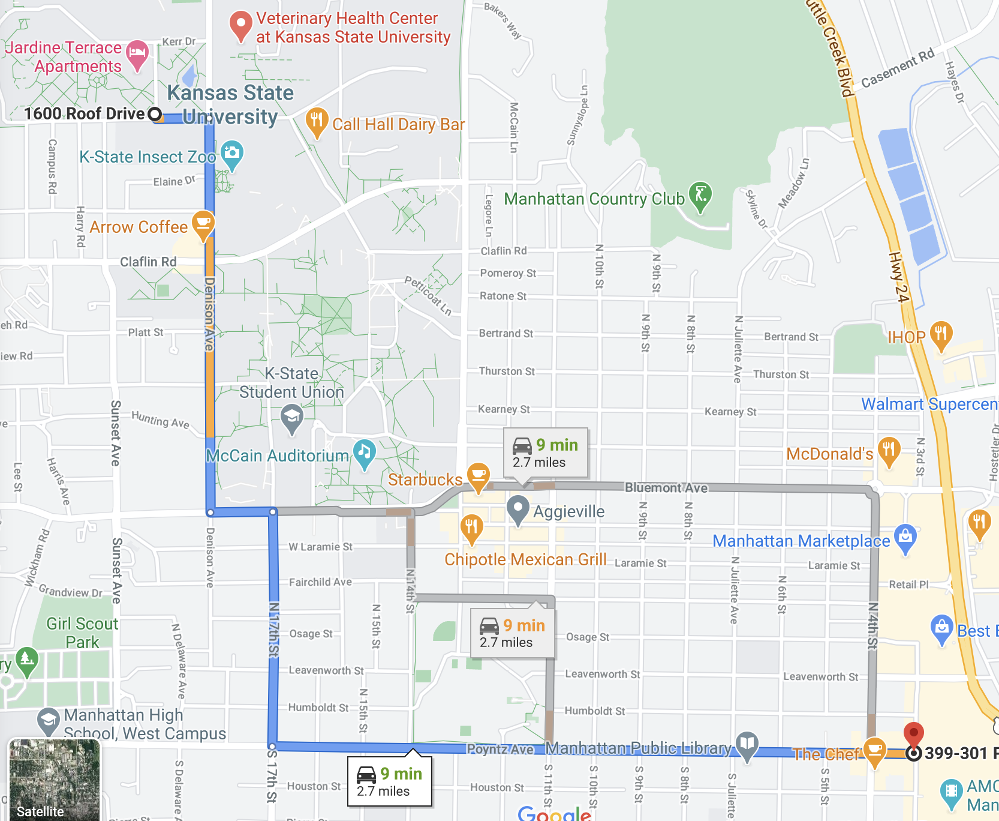
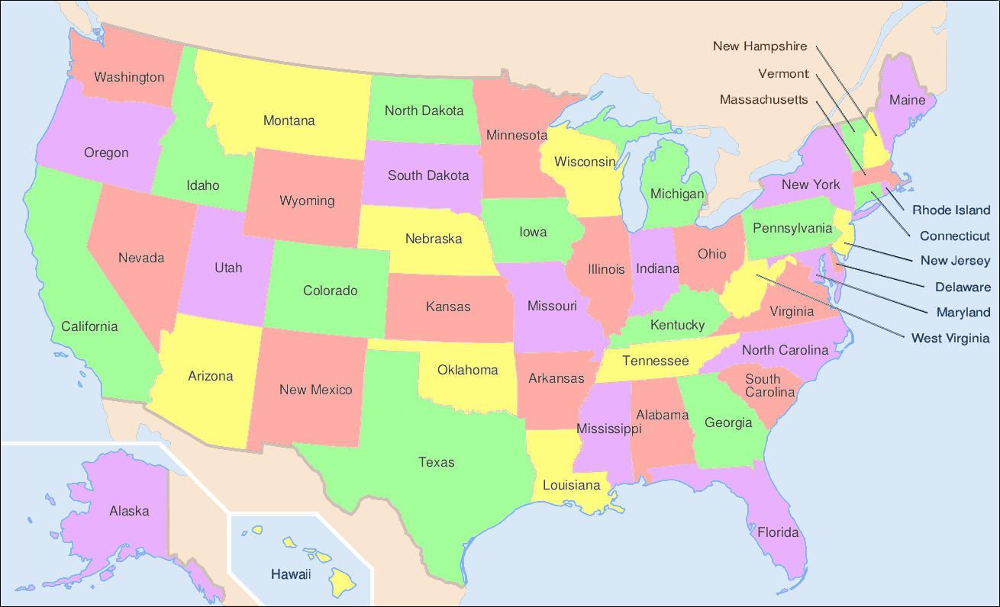
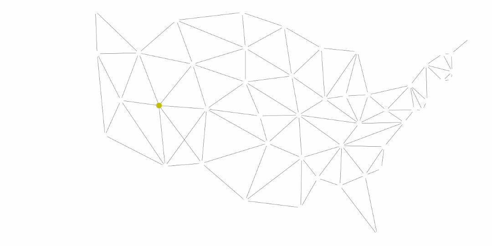

Traveling
---
Finding a path in a graph is a very common application in many fields. One application that we benefit from in our day to day lives is traveling. Programs like Google Maps calculate various paths from point A to point B.

^[google.com/maps]

In the context of graph data structures, we can think of each intersection as a node and each road as an edge. Google Maps, however, tracks more features of edges than we have discussed. Not only do they track the distance between intersections, they also track time, tolls, construction, road surface and much more. In the next module, we will discuss more details of how we can find the shortest path. 

Map Coloring
---

Another application of the general searches is coloring maps. The premise is that we don't want two adjacent territories to have the coloring. These territories could be states, like in the United States map below, counties, provinces, countries, and much more. 

^[https://commons.wikimedia.org/wiki/File:Map_of_USA_showing_state_names.png]

The following was generated for this course using the breadth first search and `MyMatrixGraph` class that we have implemented in this course. To create the visual rendering, the Python library `NetworkX`^[https://networkx.github.io/] was used. In this rendering, the starting node was Utah. If we were to start from say Alabama or Florida, we would not have a valid four coloring scheme once we got to Nevada. Since Hawaii and Alaska have no land border with any of the states, they can be any color. 

