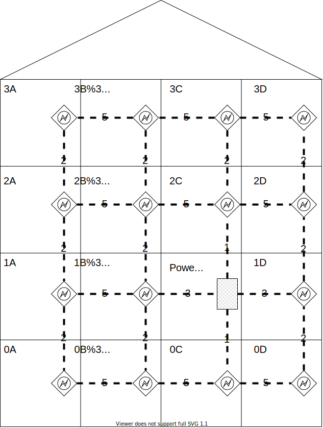
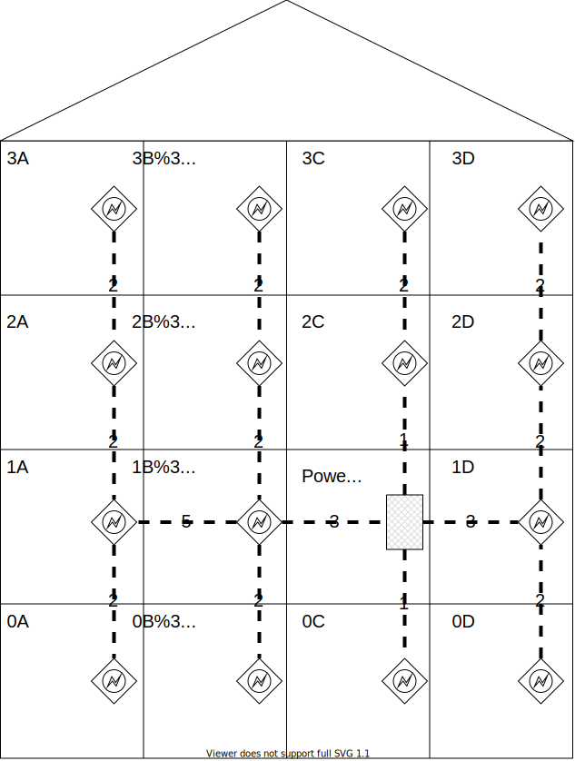
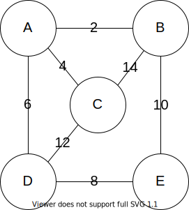
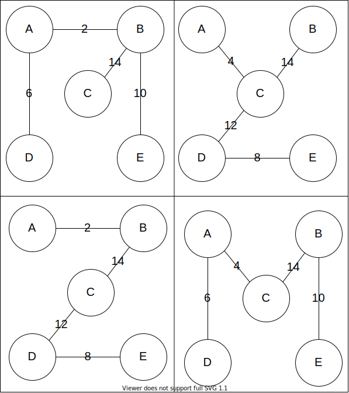
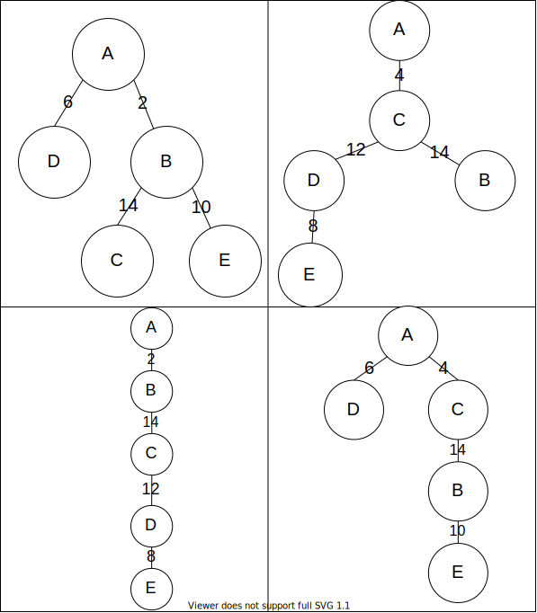
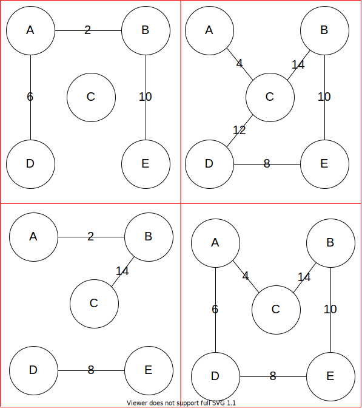

{}

We will continue to work with graph algorithms in this module, specifically with finding minimum spanning trees (MST). MSTs have many real world applications such as: 
- Electrical wiring,
- Distribution networks, 
- Telecommunication networks, and
- Network routing

Suppose we were building an apartment complex and wanted to determine the most cost-effective wiring schema. Below, we have the possible construction costs for wiring apartment to apartment. Wiring vertically adjacent apartments is cheaper than wiring horizontally adjacent units and those closest to the power closet have lower costs as well.

To find the best possible solution, we would find the MST. The final wiring schema may look something like the figure below. 

Determining a MST can result in lower costs and time used in many applications, especially logistics. 
To properly define a minimum spanning tree, we will first introduce the concept of a spanning tree. 

Spanning Trees
---
A **spanning tree** for a graph is a subset of the graphs edges such that each node is visited once, no cycles are present, and there are no disconnected components. 

Let's look at this graph as an example. We have five nodes and seven edges. 

Below, we have valid examples of spanning trees. In each of the examples, we visit each node and there are no cycles. Recall that a cycle is a path in which the starting node and ending node are the same. 

{}

To be a spanning tree of a graph, it must:
- __span__ the graph, meaning all nodes must be visited, and
- be a __tree__, meaning there are no cycles and no disconnected components. 

Further, we can imagine selecting a node in a spanning tree as the root and letting gravity take effect. This gives us a visual motivation as to why they are called spanning trees. In these examples, we have selected node A for the root for each of the spanning trees above. 

{}

Counterexamples
---
Below, we have invalid examples of spanning trees. In the left column, the examples are where all of the nodes are not connected in the same component. In the right column, the examples contain cycles. For example in the top right, we have the cycle `B->C->D->E->B`

