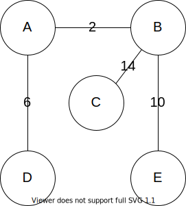
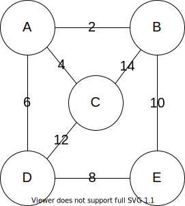
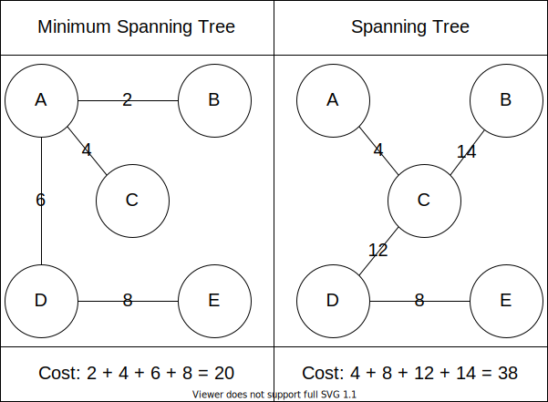
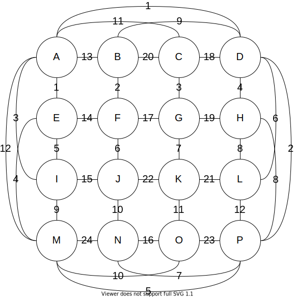

{}

Now that we have an understanding of general spanning trees, we will introduce the concept of minimum spanning trees. First let's introduce the concept of the cost of a tree. 

The **cost** that is associated with a tree, is the sum of its edges weights. Let's look at this spanning tree which is from the previous page. The cost associated with this spanning tree is: `2+6+10+14=32`.

Minimum Spanning Trees (MST)
---
A **minimum spanning tree** is a spanning tree that has the smallest cost. Recall the graph from the previous page.

Below on the left is a minimum spanning tree for the graph above. On the right is an example of a spanning tree, though it does not have the minimum cost.

In this small example, it is rather straightforward to find the minimum spanning tree. We can use a bit of trial and error to determine if we have the minimum spanning tree or not. However, once the graphs start to get more nodes and more edges it quickly becomes more complicated. 

There are two algorithms that we will introduce to give us a methodical way of finding the minimum spanning tree. The first that we will look at is Kruskal's algorithm and then we will look at Prim's algorithm. 
