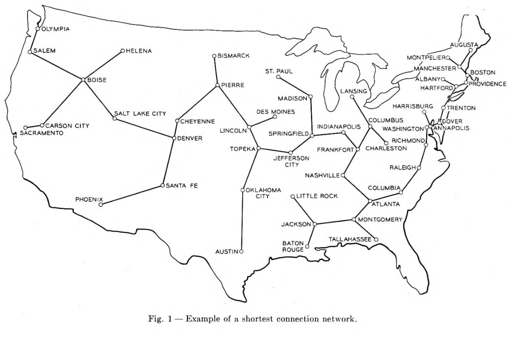
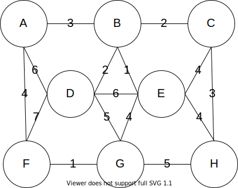
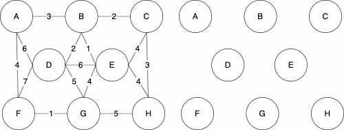
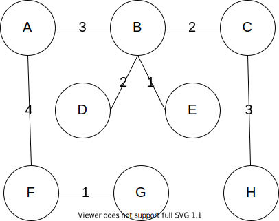

{}


The history of `Prim's Algorithm` is not as straight forward as Kruskal's. While we often call it `Prim's Algorithm`, it was originally developed in 1930 by Vojtěch Jarník. Robert Prim later rediscovered and republished this algorithm in 1957, one year after Kruskals. To add to the naming confusion, Edsger Dijkstra also published this work again in 1959. Because of this, the algorithm can go by many names: `Jarkík's Algorithm`, `Jarník-Prim's Algorithm`, `Prim-Dijkstra's Algorithm`, and `DJP Algorithm`.

Prim cited "large-scale communication" as the motivation for this algorithm, specifically the "Bell System leased-line"^[R.C. Prim, May 8, 1957 Shortest Connection Networks And Some Generalizations https://archive.org/details/bstj36-6-1389]. Leased lines were used primarily in a commercial setting which connected business offices that were geographically distant (IE in different cities or even states). Companies would want all offices to be connected but wanted to avoid having to lay an excessive amount of wire. Below is a figure which Prim used to motivate the need for the algorithm. This image depicts the minimum spanning tree which connect each of the US continental state capitals along with Washington D.C. 




Algorithm 
---
The basis of the algorithm is to start with only the nodes of the graph, then we do the following

1. Choose a random node
1. Grow your tree by one edge, selecting the smallest edge to connect to a node that is not yet in the tree. Repeat until all the nodes have been visited

Starting Graph
---





Resulting MST
---


{}

**Uniqueness**

You may have noticed that the minimum spanning tree that resulted from Kruskal's algorithm differed from Prim's algorithm. We have displaying them both below for reference. 

| Kruskal | Prim |
|--- | --- |
| |  |

While these are different, they are both valid. The trees both have cost 16. The MST of a graph will be unique, meaning there is only one, if none of the edges of the graph have the same weight. 

{}

Pseudocode
---
``` tex
function PRIM(GRAPH, START)
    MST = GRAPH without the edges attribute(s)
    VISITED = empty set
    add START to VISITED
    AVAILEDGES = list of edges where START is the source
    sort AVAILEDGES
    while VISITED is not all of the nodes
        SMLEDGE = smallest edge in AVAILEDGES
        SRC = source of SMLEDGE
        TAR = target of SMLEDGE
        if TAR not in VISITED
            add SMLEDGE to MST as undirected edge
            add TAR to VISITED
            add the edges where TAR is the source to AVAILEDGES
        remove SMLEDGE from AVAILEDGES
        sort AVAILEDGES
    return MST
```
