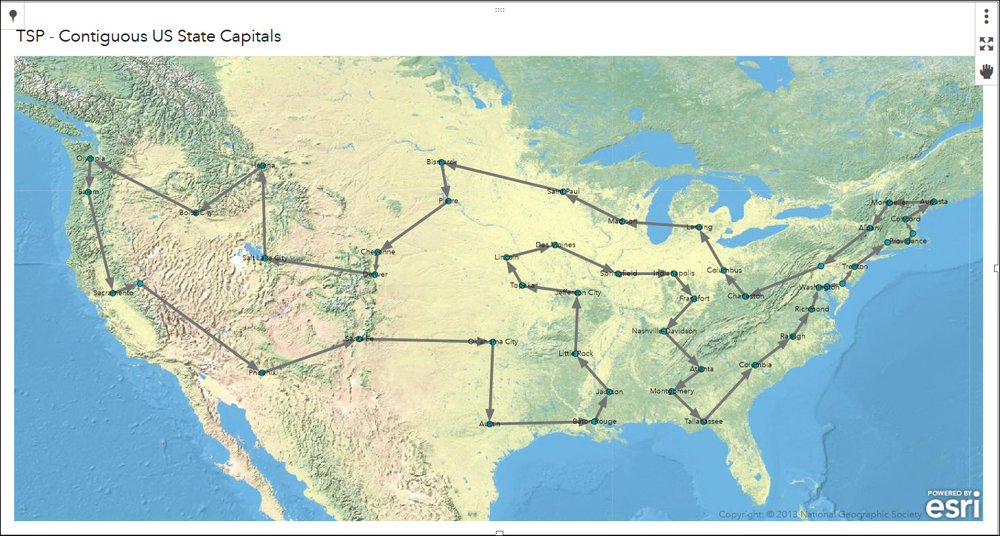

{}

{}

While we won't outline algorithms suited for solving the traveling salesperson problem (TSP), we will outline the premise of the problem. This problem was first posed in 1832, almost a two centuries ago, and is still quite prevalent. It is applicable to traveling routes, distribution networks, computer architecture and much more. The TSP is a seminal problem that has motivated many research breakthroughs, including Kruskals algorithm! 

The motivation of the TSP is this: given a set of locations, what is the shortest path such that we can visit each location and end back where started? 

Suppose we wanted to take a roadtrip with friends to every state capital in the continental US as well as Washington D.C. To save money and time, we would want to minimize the distance that we travel. Since we are taking a roadtrip, we would want to avoid frivolous driving. For example, if we start in Sacremento, CA we would not want to end the trip in Boston, MA. The trip should start and end at the same location for efficiency. 

The figure below shows the shortest trip that visits each state capital and Washington D.C. once. In this example, we can start where ever we like and will end up where we started. 
^[PatriciaNeri, August 2018 https://communities.sas.com/t5/SAS-Communities-Library/What-is-the-shortest-tour-that-visits-only-once-the-48/ta-p/490231]

In this problem, it is easy to get overwhelmed by all of the possibilities. Since there are 49 cities to visit, there are over `6.2*10^60` possibilities. For reference, `10^12` is equivalent to one trillion! Thus, we need an algorithmic approach to solve this problem as opposed to a brute force method. 

